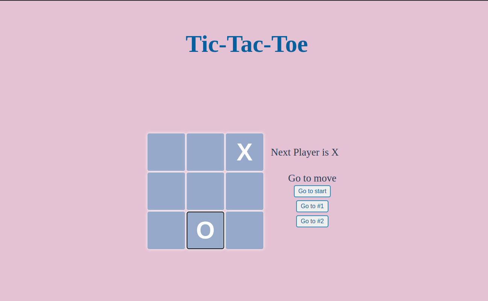

## Tic-Tac-Toe Game:

### Functionality
- There are 2 players, **player X** starts the game and then **player O** continues.
- The moves are alternating between the 2 players until one of the players has drawn a row of three of their symbols or until the board is full and nobody wins.
- The information about a winning player is displayed. The players have the option to restart the game by clicking on go to start.

### Screenshot
    

## Technologies Used
- React (18.2.0)

## Setup
To use this project, install it locally using npm:

```
$ git clone git@github.com:dimilidi/tic-tac-toe.git
$ cd tic-tac-toe
§ npm install
$ npm start
```
